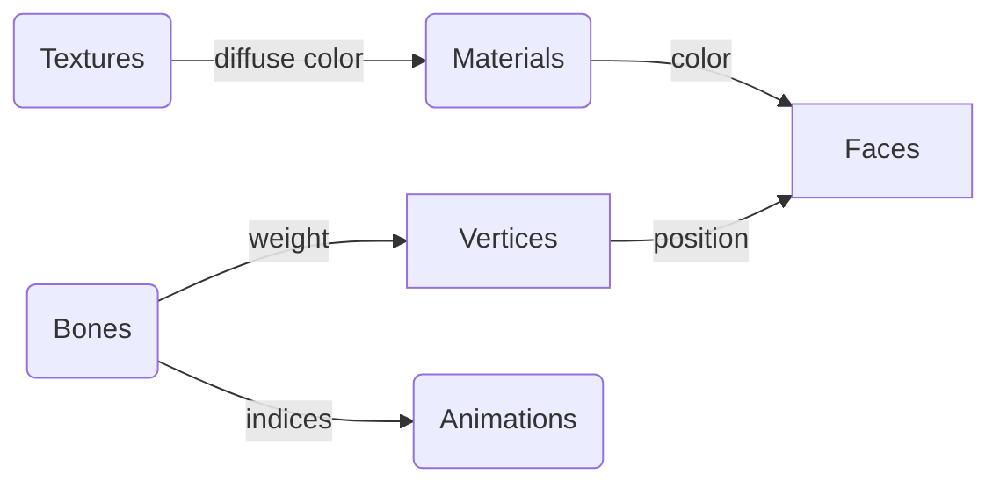
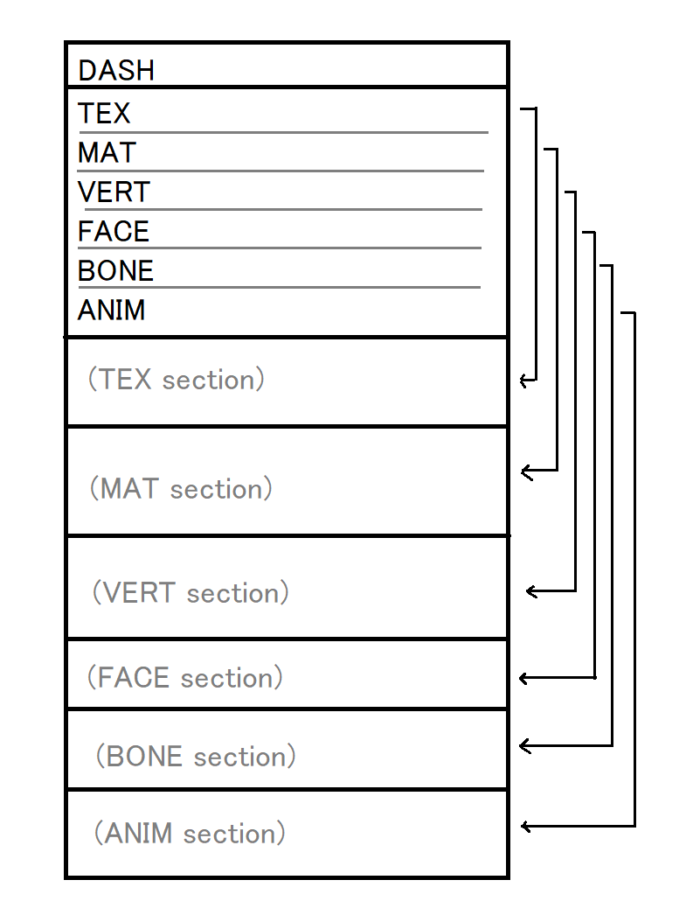

# Dash Model Exchange

The Dash Model (eXchange) format `.dmx` is a binary and json format designed to be simple but flexible to be easily supported and consistant across a languages and applications. &#x20;

### Design Principles

* Design is applied to binary first, then adopted to JSON
* JSON and binary have a 1:1 relationship to switch between the two
* Targeted towards "Dreamcast" level model
* Structures are rigged, but should support a number of cases
* Binary should be easily readable
* Binary should be small-ish
* JSON should be small-ish
* Should support linked-data and signing
* Support should be constant across a number of applications
* Constants and design should adopt from Three.js where ever possible

### Structure



## JSON

### Type

```typescript
type DashTexture = {
    texture: DashTexture[] | undefined;
    material: DashMaterial[] | undefined;
    vertex: DashVertex[];
    face: DashFace[];
    bone: DashBone[] | undefined;
    animation: DashAnimation | undefined; 
}
```

## Binary

<figure><figcaption><p>Figure for DashGL binary file layout</p></figcaption></figure>

### Version Changes

The following changes have been made since version 1.0

* More structs conform to `0x10` boundaries
* Integers are standardized to be unsigned 32 bytes
* Booleans are unsigned 32 bytes
* Enums have been changed to be 4 letter values

### Common Structs

```c
typedef struct {
	uint32_t byteOffset;
	uint32_t byteLength;
} DashRawData;
```
