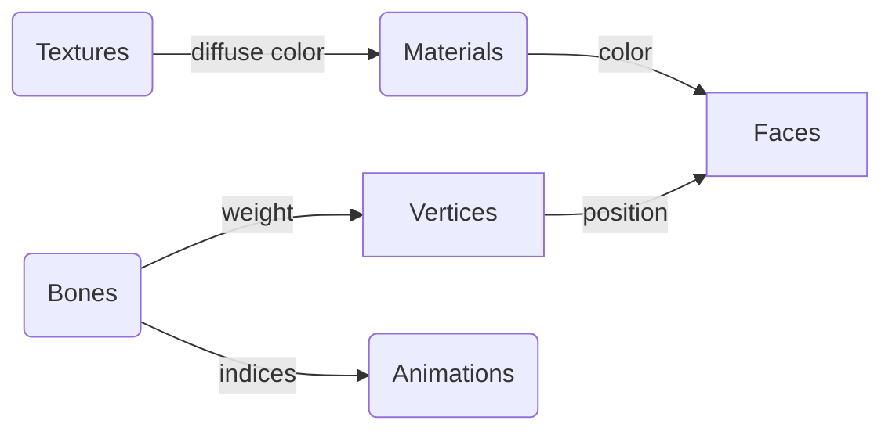

# Dash Model Exchange

The Dash Model (eXchange) format `.dmx` is a binary and json format designed to be simple but flexible to be easily supported and consistant across a languages and applications. It should be seen as the "least common demoninator" of 3d formats. As to support a minimum set of features, such as bones animations, and a limited
number of materials. But not support more extensive features such as custom shaders. The reason for this is because the expectations for the Dash Interchange format is to be able to be imported and exported between multiple applications, and result in the same file. 

The Dash Model Exchange format is available under the MIT license. This means that the file format is designed to offer the greatest amount of support and interopability between applications. The expected flow is that for any functionality that is not directly supported by the Dash Exchange format, should be
easy enough to change the format, and fork anyone of the plugins to implement desired one-off behavior for any given workflow. It is the expectation and
goal of the project that the file format and tools will be updated to support common and interopable standards as they become more widely supported. 

### Design Principles

* Design is applied to binary first, then adopted to JSON
* JSON and binary have a 1:1 relationship to switch between the two
* Targeted towards "Dreamcast" level model
* Structures are rigged, but should support a number of cases
* Binary should be easily readable
* Binary should be small-ish
* JSON should be small-ish
* Should support linked-data and signing
* Support should be constant across a number of applications
* Constants and design should adopt from Three.js where ever possible

### Structure



## JSON

### Type

```typescript
type DashTexture = {
    texture: DashTexture[] | undefined;
    material: DashMaterial[] | undefined;
    vertex: DashVertex[];
    face: DashFace[];
    bone: DashBone[] | undefined;
    animation: DashAnimation | undefined; 
}
```

### Limitations

- Do we want to allow for `null` values to support a verbose mode?

## Binary

<figure><figcaption><p>Figure for DashGL binary file layout</p></figcaption></figure>

### Version Changes

The following changes have been made since version 1.0

* More structs conform to `0x10` boundaries
* Integers are standardized to be unsigned 32 bytes
* Booleans are unsigned 32 bytes
* Enums have been changed to be 4 letter values

### Table

| Offset | 0x00  | 0x04  | 0x08       | 0x0c       |
| ------ | ----- | ----- | ---------- | ---------- |
| 0x0000 | DMX | versionMajor | versionMinor | isSkinned |
| 0x0010 | TEX | count | offset | length |
| 0x0020 | MAT | count | offset | length |
| 0x0030 | VERT | count | offset | length |
| 0x0040 | FACE | count | offset | length |
| 0x0050 | SKEL | count | offset | length |
| 0x0050 | ANIM | count | offset | length |

### Common Structs

```c
typedef struct {
	uint32_t byteOffset;
	uint32_t byteLength;
} DashData;

typedef struct {
	float x;
    float y;
} DashVec2;

typedef struct {
	float x;
    float y;
    float z;
} DashVec3;

typedef struct {
	float x;
    float y;
    float z;
    float w;
} DashVec4;
```

### Limitations

- How humanly readable do we want to make the binary format to be?
- Do we want to use arrays or structs for `vec2` and `vec3`?
- How do we account for meta data?