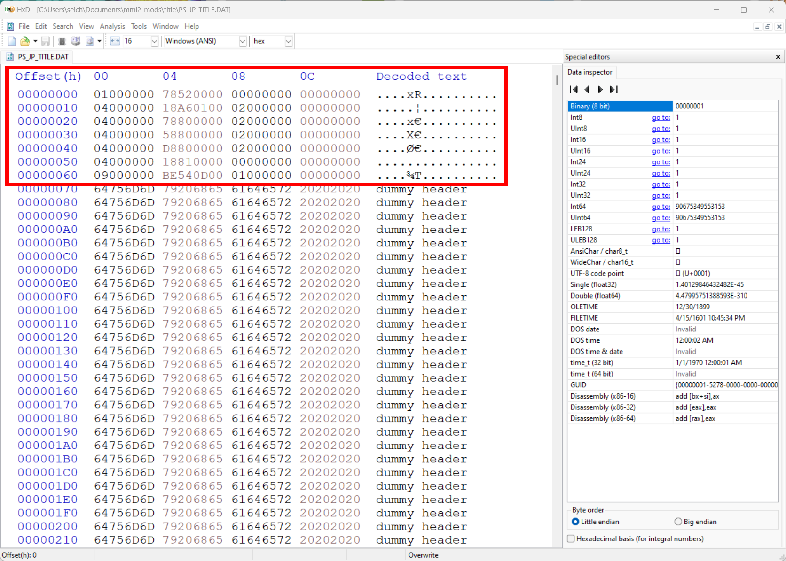
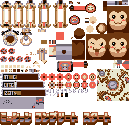

# DAT (PC)

`.DAT` is the file extension used for the PC version's archive format. The term "archive" is used loosely as the purpose of these files isn't to compress the contents, but to group assets together in a specific scene. None of the files in the archive use compression, and the files in the archive are stacked end-to-end.&#x20;

To provide a specific example, if the game wants to load in all of the assets needed for stage 0x0f, scene 0x00. The game will load the file `ST0F.DAT` to load the map data, and then `ST0F00.DAT` for all of the NPC's and enemies that make up that scenario. If the game changes scenes to stage 0x0f, scene 0x01, the game will load `ST0F01.DAT` for the NPC's and enemies for that scenario.&#x20;

This means that multiple copies of the same asset can be copied into the different scenarios they are used in. Also note that the game will used `ST0F00.DAT` for assets such as 3d models associated with that scene, and `ST0FT.DAT` for textures used in that scene.&#x20;

## File Format

<figure><figcaption>
Illustration of .DAT file structure. 
</figcaption></figure>

The image above shows the basic structure of a `.DAT` file for the PC version of Megaman Legends 2. The header is a 0x800 long section of file entries. Each entry has a length of 0x10 that defines it's type and it's length. The first file in the archive will be at offset, and each file will start directly after the previous one, with no adjustments for 16 byte alignment. In the above example, the second file starts at 0x5A78. The file ends directly after the last file in the archive with no padding.

The space between the last file entry in the header, and the first file at 0x800 is filled with the lines "dummy header" to pad the space. Also note that the above image is for illustration purposes, the header only shows the length of each file, not a pointer to its location in the file. The offset will need to be calculated.

### TITLE.DAT Example

<figure><figcaption>
Example header for TITLE.DAT (JP version)
</figcaption></figure>

We get the list of files to be as follows from the header:

1. Type: 0x01, Length: 0x5278
2. Type 0x04, Length: 0x01A618
3. Type 0x04, Length: 0x8078
4. Type: 0x04, Length: 0x8058
5. Type 0x04, Length: 0x80D8
6. Type: 0x04, Length: 0x8118
7. Type: 0x09, Length: 0x0D54BE

The type 0x04 is used to define textures. The textures contained in TTITLE.DAT are as follows:

<figure><figcaption></figcaption></figure>

 

<figure><figcaption></figcaption></figure>

 

<figure><figcaption></figcaption></figure>

 

<figure><figcaption>
Textures from the title screen in Megaman Legends 2
</figcaption></figure>

 

<figure><figcaption></figcaption></figure>

### Known Types

* 0x01
* 0x04 Textures
* 0x09

TODO: Write a script to find a list of all possible values for type definitions
