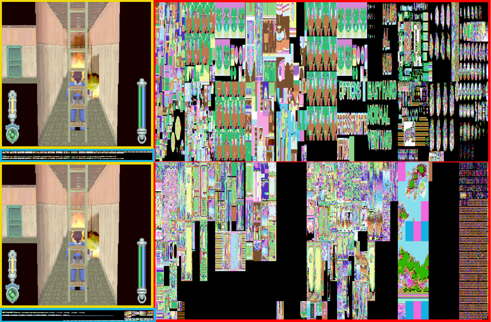

# Textures

Megaman Legends uses an arranged version of`.TIM` file format associated with the PlayStation. The data included is what would be expected for a normal, `.tim` file, but the way it's formatted in Megaman Legends means that the data on the disk would need to be read, rearranged and then written correctly to `.TIM` file, for an off-the-shelf viewer to be able to display the images.

## Bin Texture Header (PSX)

The `.BIN` format includes meta data about the texture in the PlayStation `.BIN` bundle format. The texture can have three patterns depending on where it is. Each pattern will have specific values set in the header.&#x20;

* Palette only
* Uncompressed palette + image
* Compressed palette + image

### Table

| Offset | 0x00            | 0x04         | 0x08         | 0x0c   |
| ------ | --------------- | ------------ | ------------ | ------ |
| 0x0000 | type            | full size    | palette x/y  | unk\_a |
| 0x0010 | num color / pal | image x/y    | width/height | unk\_b |
| 0x0020 | unk\_c          | bitfieldSize | unk\_d       | unk\_e |

### Struct

```c
typedef struct {
    uint32_t type;
    uint32_t fullSize;
    uint16_t paletteX;
    uint16_t paletteY;
    uint32_t unk_a;
    uint16_t colorCount;
    uint16_t paletteCount;
    uint16_t imageX;
    uint16_t imageY;
    uint16_t width;
    uint16_t height;
    uint32_t unk_b;
    uint32_t unk_c;
    uint32_t bitfieldSize;
    uint32_t unk_d;
    uint32_t unk_e;
} BinTextureHeader;
```

### Definitions

#### type

The enum type definition for the `TIM` texture map. This generally falls into three patterns

* 0x02 uncompressed palette + image in COMMON folder
* 0x02 uncompressed palette only in DAT folder
* 0x03 compressed palette + image in DAT folder

#### fullSize

This value is the "fullSize" of the image in bytes. In the case the file is compressed, this is what the file of the decompressed file, and not the size of the data included for the length of the bytes to be decompressed.

#### palette x/y

The x,y coordinates in the framebuffer where the palette colors are to be copied to.

#### color count

The number of colors included in the texture. In theory there are only two possible values, `256` or `16`. However in Megaman Legends 2, the devs like to play stupid games where they declare `64` colors. What this actually means is that there are `16` colors and `4`palettes declared in the palette section.&#x20;

In the case of `256` colors, the images are 1 byte per pixel, where if there are `16` colors the images are two bytes per pixel. In practice only the title screen and maps use `256` color. All of the assets in game use `16` color mode.

#### palette count

Is the number of palettes defined in the palette section of the image. Because all assets in game only use `16` colors in order to have models with more than `16` colors, the devs use multiple draw calls on a model, where they draw one part of the mesh, switch the palette and then draw another part of the mesh.

#### image x/y

The x,y coordinates in the framebuffer where the palette colors are to be copied to. When the game only declares a palette, these values will be zero.

#### width / height

&#x20;The width and height of image when copied to the framebuffer messured in pixels (words). In the framebuffer each pixel is 2 bytes. This means that `16` color image that is 256x256 pixels will have a framebuffer width of 64 and a height of 256.&#x20;

In order to convert the framebuffer width into a normal pixel width, the width should be multiplied by 4 for `16` colors, and by 2 for `256` colors.&#x20;

#### bitfield size

The size of the bitfield used for compression, when compression is used. A compressed image will have both the palette section and the image data compressed together. In order to decompress the image, the bitfield must first be read, an empty target buffer with the `fullSize` length initiated. And the the `bitfield` will define how to read, copy, or move the window required to decompress the payload.&#x20;

## Framebuffer

The framebuffer is a 1MB area of dedicated RAM where the PlayStation copies in images to be used as textures for 3d models and sprites.&#x20;

<figure><figcaption><p>Example of framebuffer content during gameplay</p></figcaption></figure>

The framebuffer is generally represented as a 1024x512 image, where each pixel is created by two bytes of RGBA5551 data. In the image above we can see the different areas of how Megaman Legends uses this area. In the yellow we can see the area where the screen is shown to the player and where the screen is drawn in the background outlined in yellow.

Adjacent to each of these are the palette colors which are outlined with cyan. Everything else to the right of the framebuffer outlined in red is the image data for the textures. The reason these are narrow and discolored is because these are indexed textures where the values of the pixels are numbered from 0-15 (4 bits) which represent a color in a palette. Which will be combined at draw time to produce a texture with the intended size and color.&#x20;

## Examples

### Compressed Palette + Image

In this example we will cover how to read a compressed palette + image data texture from an archive file. We will use a specific example from the file `ST0FT.BIN`, and go through the steps and code required to unpack it. Once the image is unpacked, the unpacked data should be effectively the same as&#x20;

<figure><figcaption><p>Example diagram for how to read a compressed texture from an archive file</p></figcaption></figure>

The file we're going to use as an example can be found at offset `0x01b000`. In raw binary data this looks like the following.&#x20;

```
00001b000: 03000000 20800000 0a000000 0000f900  .... ...........
00001b010: 10000100 80010001 40000001 00000000  ........@.......
00001b020: 00000000 b0040000 00000000 00000000  ................
```

We should get the following values parsed from the header.

```json
{
  type: 3,
  fullSize: 32800,
  paletteX: 0,
  paletteY: 249,
  colorCount: 16,
  paletteCount: 1,
  imageX: 384,
  imageY: 256,
  width: 64,
  height: 256,
  bitfieldSize: 1200
}
```

With respect to decompressing textures, we want to focus on `type`, `fullSize`, and `bitfieldSize`. For `type` we would expect to be decalred as `3` with a non-zero number declared in the `bitfieldSize` attribute to indicate a compressed texture. The `fullSize` attribute is the size of the target buffer.

The steps for decompressing the texture as as follws.&#x20;

1. Create the target buffer
2. Read the bitfield
3. Read the payload

The instructions for reading the payload as as files.&#x20;

1. For each bit in the bitfield read a 2 byte work
2. If the bit is 0 copy the word directly into the current offset of the target buffer
3. if the bit is 1 and the word is 0xFFFF advance the window by 0x2000
4. Otherwise if the bit is 1, read the first 3 bits of the word as the length of words, and the upper five bits as an offset from the current target offset window, and copy that those bytes to the end of the window in the target buffer
